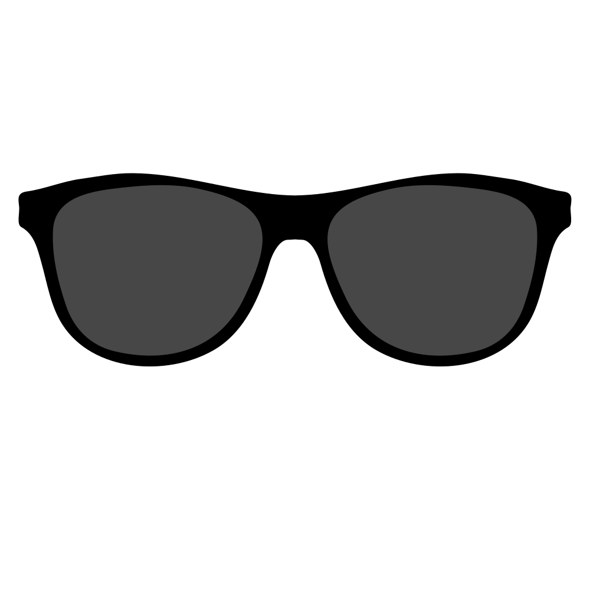
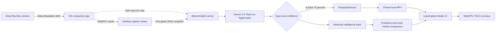

<p align="center">
  
</p>

<h1 align="center">BloomKnights</h1>

<p align="center"><strong>Look at the game. See the probability.</strong></p>

<p align="center">
  Meta glasses recognize the sport on a nearby screen, switch the viewer to the matching broadcast,
  and surface a historical prediction-market probability in seconds.
</p>

---

BloomKnights turns camera-enabled glasses into a hands-free interface for sports prediction markets. The user simply looks at a television or laptop. The system recognizes the sport, selects the matching event, loads a synchronized local replay, and presents a concise model-versus-market comparison with supporting research.

This repository is the complete hackathon implementation: Meta Ray-Ban capture, WebRTC transport, Gemini vision classification, four historical event packs, local replay switching, prediction timelines, WebGPU player tracking, and the liquid-glass presentation layer.

> [!IMPORTANT]
> This README is the source of truth for teammates and AI coding tools. The current hackathon path recognizes one prerecorded event per supported sport. It does not claim to identify every live game in the world.

## The experience

1. Open `/capture` on the presentation laptop.
2. Start the Meta glasses stream from the iOS app.
3. Press **Analyze** on the capture page.
4. Look at basketball, American football, soccer, or UFC/MMA footage.
5. Gemini classifies the sport from one WebRTC snapshot.
6. At 70% confidence or higher, the theater switches to the corresponding local broadcast.
7. BloomKnights displays a backtested probability, an illustrative historical market price, research context, and the model-market gap.
8. Look at a different supported sport and the viewer switches again.

No sport picker. No market search. No chatbot. The camera is the interface.

## Supported showcase

| What the glasses see | Local broadcast selected | Intelligence pack |
|---|---|---|
| Soccer | 2022 FIFA World Cup Final — Argentina vs France | Trophy probability timeline |
| Basketball | Boston Celtics at New York Knicks — April 9, 2026 | Knicks win probability timeline |
| American football | Super Bowl LI — Patriots vs Falcons | Patriots comeback probability timeline |
| UFC / MMA | UFC 229 — Khabib vs McGregor | Khabib win probability timeline |
| Anything else | No switch | `unclear` |

The classifier intentionally returns only five values:

```text
basketball | american_football | soccer | mma | unclear
```

Because there is exactly one showcase replay per supported sport, asking the vision model for teams, scores, players, clocks, or event names would add latency without improving stream selection.

## Architecture



### Media and control are separate

The continuous glasses video is sent over WebRTC. It is not proxied through the web server or Cloudflare tunnel. The server carries only:

- WebRTC signaling metadata;
- one compressed analysis snapshot at a time;
- playback commands and application JSON;
- the four local replay files.

This keeps the live media path low-latency while still allowing the backend to own detection and playback decisions.

### Detection cadence

- Analysis is off until the user presses **Analyze**.
- The first usable frame is submitted immediately.
- Each request contains exactly one frame.
- Later snapshots are limited to one every 12 seconds.
- The snapshot is scaled to a maximum edge of 960 pixels and encoded as JPEG.
- Only the newest frame is classified.
- Switching requires at least 70% event confidence.
- Unclear or low-confidence results preserve the current theater source.

Phone and glasses feeds use the same backend contract. The browser samples the incoming WebRTC track itself, so Meta detection does not depend on a separate native HTTP uploader.

### Vision provider

Production detection uses the Gemini-native API through RightCodes:

```text
provider  RightCodes Gemini-compatible gateway
model     gemini-3.5-flash
input     one JPEG
output    sport classification + confidence
```

The direct Google Gemini backend remains compatible through environment configuration. Cerebras is still available as a fallback backend but is not the current live selector.

### Playback policy

`PlaybackDirector` is the single authority for stream changes.

- A supported sport at 70% confidence can select its replay.
- Repeated detections of the current sport do not restart or reseek the video.
- Only a different supported `pack_id` creates a new playback revision.
- Below-threshold or unclear observations never blank the current replay.
- Disconnecting the camera returns the interface to the camera-waiting state.
- Every media asset is pinned by filename, byte size, duration, and SHA-256.

### Predictions and provenance

The four events are historical, so BloomKnights uses deterministic intelligence packs rather than spending model quota inventing probabilities live.

Each pack contains:

- calibrated probability checkpoints;
- an illustrative historical market probability;
- cached evidence and clearly labeled mock web research;
- key factors, what changed, and the next probability trigger;
- alternate prediction-market questions;
- an explicit historical-replay disclosure.

Known checkpoints use their calibrated values. In-between states can interpolate between adjacent archived anchors using the visible phase and clock. The final result is never substituted into an earlier point-in-time estimate.

> [!NOTE]
> Market values in the showcase are illustrative historical replay prices, not live quotes or trading advice.

## Quick start

### Requirements

- Node.js 20 or newer
- macOS for the full iOS/Meta workflow
- A RightCodes or Google Gemini-compatible API key
- Optional: Xcode 16+, a physical iPhone, and paired Meta Ray-Ban glasses

The web server has no runtime npm dependencies.

### Run locally

```bash
npm start
```

Then open:

```text
http://localhost:3000/capture
```

Useful commands:

```bash
npm test                 # complete node:test suite
npm run evaluate         # deterministic vision-fixture evaluation
npm run streams:validate # verify replay files against the manifest
npm run phone:tunnel     # optional phone-access helper
```

### Environment

Copy the example file and add credentials locally:

```bash
cp .env.example .env
```

Current live configuration:

```dotenv
HOST=0.0.0.0
PORT=3000

VISION_BACKEND=gemini
CEREBRAS_FRAMES_PER_REQUEST=1
CEREBRAS_MODEL_INTERVAL_MS=12000

GEMINI_API_BASE_URL=https://right.codes/gemini/v1beta
GEMINI_VISION_MODEL=gemini-3.5-flash
RIGHTCODES_API_KEY=
```

TURN credentials are optional on ordinary networks and strongly recommended on client-isolated university Wi-Fi. Never place provider keys in browser JavaScript or committed source files.

## Demo-day runbook

1. Start the server with `npm start`.
2. Confirm `GET /api/health` reports:
   - `status: "ok"`;
   - `vision.selected: "gemini"`;
   - `analysis_queue.frames_per_request: 1`;
   - all four replay files ready.
3. Open `https://capture.saicharanramineni.com/capture` on the presentation laptop.
4. Hard-refresh once so the latest capture JavaScript is loaded.
5. Start the glasses feed in the iOS app.
6. Wait for the WebRTC picture, then press **Analyze**.
7. Point the glasses at one supported sport until the local replay loads.
8. Switch to a different sport to demonstrate automatic selection.

The quota-free rehearsal remains available at:

```text
/capture?demo=1&cycle=1
```

It is explicitly labeled as rehearsal data and makes no vision-model calls. See [the complete runbook](docs/demo-day/runbook.md) for stage recovery procedures.

## Application surfaces

| Route | Purpose |
|---|---|
| `/capture` | Primary theater, WebRTC receiver, Analyze control, predictions, and overlays |
| `/phone` | Browser-based phone camera provider and development fallback |
| `/` | Product dashboard |
| `/data` | Intelligence and dataset view |
| `/landing` | Judge-facing marketing page |
| `/pitch` | Browser-based pitch deck |

## HTTP API

| Method | Route | Purpose |
|---|---|---|
| `GET` | `/api/health` | Provider, quota, stream, and playback readiness |
| `POST` | `/api/analysis/start` | Explicitly enable snapshot analysis |
| `POST` | `/api/analysis/stop` | Stop model calls without interrupting WebRTC |
| `POST` | `/api/frames` | Submit one analysis snapshot |
| `GET` | `/api/latest` | Latest analyzed live insight |
| `GET` | `/api/playback` | Current server-owned playback revision |
| `GET` | `/api/demo/intelligence` | Four historical intelligence packs |
| `GET` | `/api/demo/streams` | Replay readiness and manifest coverage |
| `GET` | `/api/demo/replay` | Quota-free rehearsal checkpoint |
| `GET/HEAD` | `/demo-streams/:stream_id` | Seekable, allowlisted local MP4 |
| `GET/POST` | `/api/webrtc/active` | Discover or claim the single active provider session |
| `POST` | `/api/webrtc/signal` | Relay SDP/ICE signaling only |
| `GET` | `/api/webrtc/poll` | Poll peer signaling messages |
| `GET` | `/api/webrtc/config` | Session-bound STUN/TURN configuration |
| `POST` | `/api/reset` | Clear analysis, signaling, and playback state |

There is intentionally no chatbot endpoint. Gemini quota is reserved for visual detection.

## Repository map

```text
apps/
  demo-web/       Capture theater, phone sender, dashboard, and data UI
  ios/            SwiftUI companion and Meta Wearables integration
  landing/        Marketing page
  pitch/          Browser pitch deck

demo-footage/     Four pinned, compressed showcase broadcasts
docs/             Architecture, API, demo-day, launch, and training docs
models/           Model metadata and calibration notes
packages/
  fixtures/
    demo-intelligence/  Historical event timelines and research
    demo-streams/       Media manifest and calibrated offsets

services/
  api/            HTTP server and live analysis orchestration
  capture/        Frame ingestion, sampling, and dataset hooks
  demo/           Intelligence routing and playback policy
  vision/         Gemini, Cerebras, fixtures, normalization, reconciliation
  probability/    Sport-aware probability models
  market/         Market adapters and comparison contracts

scripts/          Evaluation, validation, stats, and tunnel helpers
tests/            End-to-end and package-level node:test coverage
```

## Important files

| File | Responsibility |
|---|---|
| [`services/api/server.js`](services/api/server.js) | HTTP routes, analysis gate, WebRTC signaling, replay serving |
| [`services/api/live-event-analyzer.js`](services/api/live-event-analyzer.js) | One-frame cadence, event switching, live insight assembly |
| [`services/vision/backends/gemini.js`](services/vision/backends/gemini.js) | Gemini-compatible image classification |
| [`services/demo/intelligence.js`](services/demo/intelligence.js) | Event-pack matching and historical probabilities |
| [`services/demo/playback-director.js`](services/demo/playback-director.js) | Server-owned stream-switch state machine |
| [`packages/fixtures/demo-streams/manifest.json`](packages/fixtures/demo-streams/manifest.json) | Exact media integrity and checkpoint offsets |
| [`apps/demo-web/capture.html`](apps/demo-web/capture.html) | Theater UI, WebRTC snapshots, playback application, WebGPU overlays |
| [`apps/ios/README.md`](apps/ios/README.md) | Meta SDK build and device instructions |

## Team boundaries

| Owner | Scope |
|---|---|
| Vision/backend lane | Camera snapshots, provider integration, classification, intelligence packs, playback commands |
| Frontend teammate | Next.js product surface and shared API consumption |
| Native-app teammate | Meta SDK session, glasses permissions, decoding, and WebRTC publishing |

The internal boundary is `/api/frames` plus the WebRTC signaling contract. Hardware-specific code must not leak into the probability or playback layers.

## Rules for contributors and AI agents

1. Read this README and [the documentation index](docs/README.md) before changing architecture.
2. Treat the live checkout as shared. Preserve unrelated dirty files and teammate work.
3. Keep the classifier narrow. One showcase stream per sport means sport-only classification is intentional.
4. Never reintroduce a five-frame model window for the live showcase.
5. Never make model calls until the user presses **Analyze**.
6. WebRTC carries media; HTTP carries snapshots and control data.
7. `PlaybackDirector` owns stream changes. Do not switch media directly from an arbitrary client result.
8. Keep replay markets and mock research visibly labeled.
9. Never hard-code credentials into tracked source or frontend bundles.
10. Run the narrowest relevant tests, then `npm test` before merging when time permits.
11. Validate replay files with `npm run streams:validate` after any media change.
12. Push small completed changes so every teammate sees the same contract.

## Honest scope and limitations

- The live showcase recognizes four sport categories, not arbitrary event identities.
- Each category maps to one predetermined historical broadcast.
- Probabilities and market prices are replay intelligence, not live tradable quotes.
- Research results are cached and explicitly marked mock.
- WebGPU/YOLO overlays are presentation context; they do not select the event.
- The WebRTC connection may require TURN on restrictive campus networks.
- The project does not execute trades, manage funds, or claim guaranteed profit.

## Documentation

- [Documentation index](docs/README.md)
- [Implemented architecture](docs/architecture/ARCHITECTURE.md)
- [API reference](docs/architecture/API.md)
- [Local replay contract](docs/LOCAL_STREAM_PLAYBACK.md)
- [Demo-day runbook](docs/demo-day/runbook.md)
- [Setup checklist](docs/demo-day/setup-checklist.md)
- [Failure recovery](docs/demo-day/failure-modes.md)
- [Judge Q&A](docs/demo-day/judge-qa.md)
- [iOS and Meta glasses](apps/ios/README.md)

## Responsible-use language

Prefer **model estimate**, **market-implied probability**, **difference**, **historical replay**, and **confidence**.

Avoid **guaranteed edge**, **risk-free**, **certain win**, or instructions to place a trade. A probability gap is a signal to investigate, not proof of profit.

## The pitch

**One sentence:** BloomKnights lets smart glasses recognize the sport you are watching and instantly surface the matching prediction-market probability.

**Ten seconds:** Prediction markets make you search for the right contract while the game keeps moving. With BloomKnights, you just look at the screen—your glasses identify the sport, load the event, and show the probability.

**Thirty seconds:** BloomKnights turns Meta glasses into a visual interface for prediction markets. The glasses stream directly to the laptop over WebRTC. A lightweight Gemini classifier recognizes the sport from one gated snapshot, the backend switches to the matching historical broadcast, and the viewer presents a backtested probability beside an illustrative market price and supporting context. No menus, no typing, and no manual sport selection.

---

<p align="center"><strong>The broadcast is the query.</strong></p>
