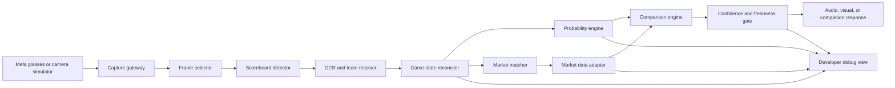

# BloomKnights

> Look at the game. See the probability.

BloomKnights is a wearable visual-intelligence system for live sports and event prediction markets. A user points camera-enabled smart glasses at a screen showing a live event. The system reads the visible game state, estimates the probability of an outcome, compares that estimate with the current prediction-market price, and returns a short, useful result through a glasses-friendly interface.

The first hackathon version is focused on one experience:

> Point Meta glasses at a live NBA broadcast and hear or see the model's current win probability alongside the prediction market's implied probability.

Example output:

```text
Boston vs. New York — 4Q, 02:14
Model: 68% Boston
Market: 59% Boston
Difference: +9 percentage points
State confidence: High
```

This README is the source of truth for humans and AI coding tools working on the project. Read it before making architectural or product decisions.

---

## 1. Executive summary

Live prediction markets are difficult to follow while watching an event. The user has to identify the correct market, interpret rapidly changing game conditions, switch between screens, and decide whether the current price reflects what just happened.

BloomKnights removes that interaction cost. The live screen becomes the input. Computer vision converts the broadcast into structured state, a probability engine estimates the outcome, and a market adapter retrieves the comparable market price. The system presents the difference without requiring the user to type, search, or leave the event.

The product is not intended to understand every pixel or narrate every play. For the hackathon, computer vision has a narrower and more reliable job: recover enough structured state to estimate a live outcome probability.

The core pipeline is:

```text
Glasses camera
    -> selected video frames
    -> event and scoreboard recognition
    -> reconciled game state
    -> model probability
    -> prediction-market price
    -> comparison and confidence checks
    -> concise wearable response
```

## 2. Product thesis

Prediction markets become more useful when they can react to what the user is already seeing.

Today, most prediction-market interfaces begin with a list of markets. BloomKnights begins with the physical world. The user looks at an event, and the system determines what is happening, finds the relevant market, and explains how its estimate compares with that market.

The sports demo is the wedge, not the ceiling. The same visual-to-probability architecture could eventually support esports, elections, award shows, financial broadcasts, and other live events. Those are future directions, not hackathon requirements.

## 3. The north-star experience

1. A user watches an NBA game on a television or laptop.
2. The user looks at the broadcast through Meta glasses.
3. BloomKnights identifies the teams and reads the scoreboard.
4. It constructs the current game state: score, quarter, clock, and any other reliably available features.
5. It estimates each team's probability of winning.
6. It finds the matching prediction-market contract and reads the latest price.
7. It reports the model probability, market probability, difference, and confidence.
8. As the visible state changes, the estimate updates.

A good response is glanceable or speakable in a few seconds:

```text
Boston 68%. Market 59%. Model is 9 points higher.
```

A bad response is a dashboard full of unexplained numbers, an uncalibrated claim of guaranteed profit, or a result based on stale or low-confidence state.

## 4. What we are building for the hackathon

### Primary use case

Live win-probability comparison for an NBA game visible on a screen.

### Required inputs

- Camera frames originating from the glasses or a development-time camera substitute.
- A broadcast scoreboard containing identifiable teams, score, period, and game clock.
- A configured prediction-market source or a realistic mock adapter for the exact demo matchup.

### Required outputs

- Identified event and teams.
- Latest reconciled game state.
- Model-estimated win probability.
- Market-implied probability and timestamp.
- Difference in percentage points.
- State confidence and freshness.
- A compact visual or spoken response.

### Must-have capabilities

- Ingest still frames or a low-rate video stream.
- Locate and parse the scoreboard region.
- Normalize team names or abbreviations to stable internal IDs.
- Reject or retain the previous state when a frame is unreadable.
- Calculate a deterministic win probability from the structured state.
- Match the game to one market contract.
- Fetch or simulate a timestamped market price behind a clean adapter interface.
- Return a response only when the state and market data are sufficiently trustworthy.
- Run an end-to-end demo from camera input to user-facing result.

### Should-have capabilities

- Update after meaningful state changes instead of on every frame.
- Smooth noisy OCR across multiple frames.
- Provide audio output suitable for glasses.
- Show a debug view containing the captured frame, parsed state, probability, market price, latency, and confidence.
- Support a prerecorded broadcast clip as a deterministic demo source.

### Nice-to-have capabilities

- Detect possession, timeouts, or recent scoring events.
- Support more than one broadcast scoreboard layout.
- Support a second game or a second sport.
- Notify only when the probability difference crosses a configured threshold.

## 5. Explicit non-goals

These are not part of the first hackathon build unless the primary flow is already complete:

- Automated trade execution.
- Claims of guaranteed profit or a guaranteed informational advantage.
- Support for every sport, broadcast network, or prediction market.
- Full play-by-play understanding from raw video.
- Player tracking or player-prop pricing.
- Training a large end-to-end video model.
- Millisecond high-frequency trading infrastructure.
- Perfect recognition during cuts, commercials, replays, or obstructed scoreboards.
- A production-grade identity, payments, wallet, or custody system.
- A general-purpose augmented-reality operating system.

The hackathon succeeds when one complete path works convincingly. Breadth is secondary.

## 6. Product language

Use careful, credible language in the UI, demo, and presentation.

Prefer:

- "Model estimate"
- "Market-implied probability"
- "Difference" or "model-market gap"
- "Potential mispricing"
- "State confidence"
- "Data last updated"

Avoid:

- "Guaranteed edge"
- "Risk-free"
- "Certain win"
- "The market is wrong"
- "Place this trade now"

The model and the market measure related but not perfectly identical things. A displayed difference is a signal to inspect, not proof of profit.

## 7. System architecture



### 7.1 Capture gateway

The capture gateway isolates hardware-specific behavior from the rest of the system. It should accept images through a simple internal interface regardless of whether the source is:

- A supported glasses camera stream.
- A phone companion application.
- A laptop webcam.
- Uploaded screenshots.
- Frames extracted from a prerecorded demo video.

Do not couple the vision pipeline directly to one device SDK. Hardware integration will change; the internal frame contract should not.

Minimum frame metadata:

```json
{
  "frame_id": "frame_000184",
  "captured_at": "2026-07-11T20:14:32.491Z",
  "source": "glasses",
  "image_uri": "local-or-object-storage-reference",
  "width": 1920,
  "height": 1080
}
```

### 7.2 Frame selector

Running expensive vision on every video frame is unnecessary. The selector should sample at a low rate and increase the rate only when the visible screen changes meaningfully.

Initial target:

- Sample approximately 1-2 frames per second.
- Skip near-duplicate frames.
- Prefer sharp, unobstructed frames.
- Ignore frames that do not appear to contain a broadcast or scoreboard.

### 7.3 Scoreboard detector and parser

The vision layer should extract structured facts rather than return prose.

Minimum target fields:

```json
{
  "sport": "basketball",
  "league": "NBA",
  "away_team_text": "BOS",
  "home_team_text": "NYK",
  "away_score": 104,
  "home_score": 101,
  "period": 4,
  "clock_seconds": 134,
  "shot_clock_seconds": 14,
  "possession_team_text": "BOS",
  "scoreboard_bbox": [72, 881, 890, 1058],
  "field_confidences": {
    "teams": 0.98,
    "scores": 0.96,
    "period": 0.99,
    "clock": 0.94,
    "possession": 0.61
  }
}
```

Only team identity, scores, period, and clock are required for the first probability model. Optional fields must never block the primary flow.

Possible implementation paths include conventional OCR on a detected scoreboard crop, a multimodal model producing schema-constrained JSON, or a hybrid. The best hackathon implementation is the one that is stable on the chosen demo footage.

### 7.4 Team and event resolver

Broadcast labels, model labels, and prediction-market labels will differ. Resolve all of them to stable internal identifiers.

Example:

```json
{
  "event_id": "nba_2026_07_11_bos_nyk",
  "league": "NBA",
  "away_team_id": "nba_bos",
  "home_team_id": "nba_nyk",
  "scheduled_start": "2026-07-11T23:30:00Z"
}
```

Resolution should consider:

- Known abbreviations and aliases.
- Scheduled start time.
- Home and away orientation.
- The active-event list from the market adapter.
- Whether scores and event status are plausible.

Never match only on fuzzy team text when multiple candidate events are possible.

### 7.5 Game-state reconciler

Single-frame OCR is noisy. The reconciler owns the canonical current state and decides whether a new observation is plausible.

For basketball, basic invariants include:

- Scores should not decrease.
- Regulation period should not decrease.
- The clock usually decreases within a period.
- A score normally changes by 1, 2, or 3 points at a time.
- Large jumps may indicate a replay, a different game, or OCR failure.
- Team identity should remain stable during a session.

The reconciler may require the same parsed value in two consecutive frames before accepting a low-confidence update. It should retain the last trusted state during brief camera movement instead of replacing it with null or bad data.

Canonical game state:

```json
{
  "event_id": "nba_2026_07_11_bos_nyk",
  "observed_at": "2026-07-11T20:14:32.491Z",
  "accepted_at": "2026-07-11T20:14:32.780Z",
  "away_team_id": "nba_bos",
  "home_team_id": "nba_nyk",
  "away_score": 104,
  "home_score": 101,
  "period": 4,
  "clock_seconds": 134,
  "possession_team_id": "nba_bos",
  "confidence": 0.95,
  "source_frame_ids": ["frame_000183", "frame_000184"]
}
```

### 7.6 Probability engine

The probability engine consumes structured game state and returns a calibrated outcome probability. It must not depend on image pixels.

Interface:

```json
{
  "event_id": "nba_2026_07_11_bos_nyk",
  "outcome": "nba_bos_wins",
  "probability": 0.68,
  "model_version": "nba-win-probability-v1",
  "computed_at": "2026-07-11T20:14:32.812Z",
  "input_state_observed_at": "2026-07-11T20:14:32.491Z",
  "confidence": 0.91
}
```

Recommended implementation order:

1. Build a deterministic baseline using score differential, time remaining, period, home-court indicator, and pregame strength.
2. Validate monotonic behavior on obvious scenarios.
3. If historical play-by-play data is available, replace or calibrate the baseline with logistic regression or gradient-boosted trees.
4. Add possession only if it is reliably extracted.

For a hackathon, a small, explainable model with reliable inputs is better than a sophisticated model fed noisy state.

Minimum behavioral tests:

- A tied game at the start should be near the pregame prior.
- A lead should become more valuable as time expires.
- A team leading by 20 with 30 seconds remaining should have a very high probability.
- Swapping home and away inputs should not silently preserve the same outcome label.
- Returned probabilities must remain between 0 and 1.

The model should report an estimate even when its confidence is lower, but the presentation gate may decide not to show that estimate to the user.

### 7.7 Prediction-market adapter

All provider-specific code belongs behind one interface. The rest of the system should not know how a provider names contracts, authenticates requests, or represents prices.

Required operations:

```text
list_live_events(league, time_window)
find_market(event_id, outcome)
get_market_snapshot(market_id)
```

Normalized market snapshot:

```json
{
  "provider": "provider-name-or-mock",
  "market_id": "market_123",
  "event_id": "nba_2026_07_11_bos_nyk",
  "outcome": "nba_bos_wins",
  "yes_bid": 0.58,
  "yes_ask": 0.60,
  "display_probability": 0.59,
  "liquidity": 12500.0,
  "provider_timestamp": "2026-07-11T20:14:31.900Z",
  "received_at": "2026-07-11T20:14:32.830Z",
  "is_mock": false
}
```

The displayed market probability should have an explicit definition. For the first version, use the midpoint of the best yes bid and ask when both exist. If only a last-trade price exists, label it accordingly in the debug interface.

Never silently combine prices from different markets or outcomes. Contract resolution is part of correctness.

### 7.8 Comparison engine

The main comparison is measured in percentage points:

```text
model_market_gap = model_probability - market_probability
```

Example:

```text
0.68 - 0.59 = 0.09 = +9 percentage points
```

Do not call this a 9% expected return. Probability difference, expected value, and realizable trading profit are not interchangeable.

Output contract:

```json
{
  "event_id": "nba_2026_07_11_bos_nyk",
  "outcome": "nba_bos_wins",
  "model_probability": 0.68,
  "market_probability": 0.59,
  "gap_percentage_points": 9.0,
  "direction": "model_higher",
  "state_confidence": 0.95,
  "freshness_ms": 930,
  "generated_at": "2026-07-11T20:14:32.840Z"
}
```

### 7.9 Confidence and freshness gate

The system should decline to present a precise comparison when its inputs are unreliable.

Initial gating rules:

- Do not present if the event cannot be resolved uniquely.
- Do not present if required scoreboard fields are missing.
- Do not present if canonical game-state confidence is below the configured threshold.
- Do not present if the market snapshot is older than the configured threshold.
- Do not present if the market is paused, closed, or mapped to a different outcome.
- Clearly mark mocked market data in developer and judge-facing demos.

Safe fallback messages:

```text
I can see the game, but the scoreboard is not clear enough yet.
```

```text
Game identified. Current market data is stale, so no comparison is available.
```

### 7.10 User experience layer

The core response must work without a dense augmented-reality display. Supported presentation modes may include:

- Short audio through the glasses.
- A minimal companion-phone card.
- A browser overlay for the hackathon demo.
- A glasses visual surface if the available hardware and SDK support it.

The backend should return presentation-neutral JSON. Device-specific clients decide how to render or speak it.

## 8. End-to-end data contract

The following represents one complete update through the system:

```json
{
  "session_id": "session_a81f",
  "event": {
    "event_id": "nba_2026_07_11_bos_nyk",
    "away_team_id": "nba_bos",
    "home_team_id": "nba_nyk"
  },
  "state": {
    "away_score": 104,
    "home_score": 101,
    "period": 4,
    "clock_seconds": 134,
    "confidence": 0.95,
    "observed_at": "2026-07-11T20:14:32.491Z"
  },
  "estimate": {
    "outcome": "nba_bos_wins",
    "probability": 0.68,
    "model_version": "nba-win-probability-v1"
  },
  "market": {
    "provider": "provider-name-or-mock",
    "market_id": "market_123",
    "probability": 0.59,
    "is_mock": false,
    "provider_timestamp": "2026-07-11T20:14:31.900Z"
  },
  "comparison": {
    "gap_percentage_points": 9.0,
    "direction": "model_higher"
  },
  "presentation": {
    "status": "ready",
    "short_text": "Boston 68%. Market 59%. Model is 9 points higher.",
    "spoken_text": "Boston's estimated win probability is 68 percent. The market is at 59 percent."
  }
}
```

Schema names may evolve, but every component should exchange typed, versionable data rather than free-form strings.

## 9. Latency and update strategy

The demo should feel live, but correctness matters more than updating on every frame.

Initial end-to-end target: return a trusted update within approximately 2-5 seconds of a stable scoreboard change.

Suggested budget:

| Stage | Target |
|---|---:|
| Frame selection and upload | 250-750 ms |
| Scoreboard detection and parsing | 500-2,000 ms |
| State reconciliation | under 100 ms after observation |
| Probability calculation | under 100 ms |
| Market lookup | 100-1,000 ms |
| Response generation and delivery | 100-500 ms |

These are design targets, not claims about current performance. Instrument every stage so the real bottleneck is visible.

Meaningful state changes should trigger updates. A new frame that produces the same score, period, and clock bucket does not need a new spoken response.

## 10. Recommended repository structure

The codebase has not yet committed to a language or framework. Preserve clear service boundaries even if the hackathon implementation runs as one process.

```text
.
├── README.md
├── docs/
│   ├── demo-script.md
│   ├── architecture.md
│   └── decisions/
├── apps/
│   ├── demo-web/             # Judge-facing/debug interface
│   └── companion/            # Optional phone or glasses client
├── services/
│   ├── api/                  # Orchestrates the pipeline
│   ├── vision/               # Scoreboard detection and parsing
│   ├── probability/          # Win-probability model
│   └── market/               # Provider adapters and mock source
├── packages/
│   ├── contracts/            # Shared schemas and types
│   └── fixtures/             # Sanitized demo frames and expected state
├── models/
│   └── metadata/             # Version and calibration information
├── scripts/
│   ├── run-demo.*
│   └── evaluate-fixtures.*
└── tests/
    ├── integration/
    └── end-to-end/
```

This is a proposed structure, not permission to create placeholder complexity. Start with the smallest implementation that preserves the contracts above.

## 11. Development strategy

Build vertical slices, not isolated impressive components.

### Slice 1: deterministic end-to-end skeleton

- Use a saved screenshot.
- Return a hard-coded but correctly structured parsed state.
- Run a deterministic probability function.
- Use a mock market adapter.
- Render the final comparison in a debug page.

This proves the interfaces and product loop.

### Slice 2: real scoreboard extraction

- Select one broadcast layout and one demo game.
- Detect or configure its scoreboard crop.
- Extract required fields.
- Add fixtures with expected JSON.
- Reject implausible updates.

### Slice 3: defensible probability model

- Implement a baseline.
- Test obvious game scenarios.
- Record the model version and features.
- Add historical calibration only if data and time permit.

### Slice 4: live or recorded camera flow

- Replace the screenshot input with webcam, phone, or glasses-originated frames.
- Sample frames and measure latency.
- Keep prerecorded input as a deterministic fallback.

### Slice 5: real market integration

- Implement one provider adapter.
- Resolve one live event to one explicit contract.
- Preserve the mock adapter for offline demos and tests.
- Display provider freshness and whether data is mocked.

### Slice 6: wearable delivery and polish

- Add concise audio or a minimal wearable-compatible response.
- Polish the debug view for judges.
- Rehearse the primary and fallback demo paths.

## 12. Team workstreams

### Current ownership boundary

- **Vision/backend lane (this repository branch):** owns the complete camera-to-insight path: frame ingestion, selection, scoreboard extraction, event resolution, temporal reconciliation, probability, market comparison, gating, and the JSON API.
- **Teammate 1:** owns the Next.js frontend and renders backend results. The frontend should not duplicate vision or probability logic.
- **Teammate 2:** owns the native app, camera permissions, frame capture, and delivery to the backend. The app should treat the backend response as the source of truth.

Until the native app is ready, `/capture` is the canonical phone-camera test client. See [`docs/VISION_PIPELINE.md`](docs/VISION_PIPELINE.md) for the live contract and operating instructions.

These tracks can progress in parallel once shared contracts are agreed upon.

### Vision and state

Owns:

- Frame ingestion.
- Scoreboard localization.
- OCR or structured visual extraction.
- Confidence scoring.
- Temporal state reconciliation.
- Fixture evaluation.

Definition of done: chosen demo footage reliably produces correct team, score, period, and clock state.

### Probability and data science

Owns:

- Feature definition.
- Baseline win-probability model.
- Historical-data preparation if used.
- Calibration and sanity checks.
- Model versioning.

Definition of done: any valid canonical state produces a deterministic, bounded, explainable probability that passes scenario tests.

### Markets and backend

Owns:

- Event and contract normalization.
- Provider and mock adapters.
- Freshness handling.
- Pipeline orchestration.
- Comparison engine and API responses.

Definition of done: the correct event resolves to the correct outcome, and the backend returns a complete typed comparison.

### Glasses, client, and demo

Owns:

- Hardware capture investigation and integration.
- Audio or visual delivery.
- Debug and judge-facing UI.
- End-to-end demo flow.
- Demo recording and fallback path.

Definition of done: a teammate can point the selected capture device at the demo broadcast and receive an understandable result without touching backend tools.

## 13. Demo plan

### Primary live demo

1. Show the selected NBA broadcast on a television or laptop.
2. Show the glasses or camera view in the debug interface.
3. Point at the scoreboard and let BloomKnights identify the game.
4. Display the structured state to prove the system read the screen.
5. Display or speak the model probability.
6. Fetch and display the market-implied probability.
7. Highlight the difference and data freshness.
8. Move to a later moment in the game and show the estimate update.

### Recommended spoken narrative

> Prediction markets know their contracts, but they do not know what I am looking at. BloomKnights connects the physical event to the market. The glasses read the visible game state, our model estimates the outcome, and we compare it with the market in real time. I never have to search for the game or leave the broadcast.

### Demo resilience ladder

Prepare all of these before presenting:

1. Live glasses capture with live market data.
2. Webcam or phone capture with live market data.
3. Prerecorded broadcast clip with live market data.
4. Prerecorded clip with timestamped mock market data.
5. Saved frames with deterministic expected outputs.

Fallbacks must remain honest. The UI should identify mocked or replayed market data.

## 14. Success criteria

The hackathon build is successful if:

- A new viewer understands the product in under 30 seconds.
- The system identifies the chosen game from its visible broadcast.
- Required scoreboard fields are correct on the curated demo sequence.
- The state reconciler avoids obvious OCR regressions.
- The probability output changes sensibly when score and time change.
- The market contract is correctly matched and timestamped.
- The model-market comparison uses a clear, mathematically correct definition.
- The user receives the result without manually searching for a market.
- The main demo works end to end, with at least one tested fallback.

Useful engineering metrics:

- Required-field accuracy on curated frames.
- Event-resolution accuracy.
- False state-update count.
- End-to-end latency.
- Market-data age at presentation time.
- Probability-model calibration, if a historical evaluation set exists.

## 15. Main risks and mitigations

### Hardware access is more restricted than expected

Mitigation: keep capture behind a source-agnostic gateway and support phone, webcam, uploaded frames, and prerecorded video. Validate hardware access early.

### Scoreboard OCR fails across broadcast layouts

Mitigation: select one broadcast layout for the demo, use a configured region when necessary, evaluate against fixed fixtures, and smooth results over time.

### Replays or commercials produce incorrect state

Mitigation: require stable team identity, enforce temporal invariants, retain the last trusted state, and expose a paused/uncertain status.

### Probability looks arbitrary

Mitigation: use a small documented feature set, test obvious scenarios, show the game state that produced the estimate, and describe it as a model estimate.

### The wrong market is matched

Mitigation: normalize team IDs, confirm scheduled time and home/away orientation, and require a unique match before presenting a comparison.

### Market data is delayed or unavailable

Mitigation: timestamp every snapshot, gate stale values, implement a mock adapter, and prepare an offline demo whose status is clearly labeled.

### The demo depends on a real game's unpredictable timing

Mitigation: use a curated prerecorded sequence for the reliable core demo and treat live input as an enhancement.

### The presentation sounds like automated gambling advice

Mitigation: describe probability estimates and differences accurately, avoid trade commands, and keep automated execution out of scope.

## 16. Privacy, security, and responsible-use baseline

Even a hackathon prototype should follow basic safeguards:

- Process only frames needed for the user-requested analysis.
- Avoid storing raw camera footage by default.
- Make recording or upload status visible.
- Do not commit API keys, user tokens, or private footage.
- Keep secrets in environment variables or the chosen secret manager.
- Use sanitized or team-owned footage for committed fixtures.
- Log structured state and latency instead of raw images when possible.
- Do not execute prediction-market trades in the hackathon MVP.
- Do not represent estimates as financial guarantees.

Any production version would require a deeper review of device privacy, market-provider terms, financial regulations, jurisdiction, age restrictions, and user consent.

## 17. AI-agent working agreement

This repository is expected to be edited by multiple teammates and AI coding tools. Agents should follow these rules:

1. Read this README before proposing or implementing work.
2. Preserve the primary end-to-end use case: visible NBA broadcast to trusted probability comparison.
3. Do not widen the sport, market, or device scope until the primary vertical slice works.
4. Keep device, vision, probability, market, and presentation concerns behind explicit interfaces.
5. Prefer typed or schema-validated data between components.
6. Never invent live market values, model evaluation results, latency measurements, or device capabilities.
7. Mark fixtures, replay data, and mocked market values clearly.
8. Add tests for state parsing, state reconciliation, probability bounds, and market mapping when modifying those areas.
9. Record meaningful architecture decisions under `docs/decisions/` once that directory exists.
10. Avoid committing secrets, downloaded private data, large generated artifacts, or raw user camera footage.
11. Keep changes narrow enough for another teammate to review quickly.
12. Update this README when a product-level decision changes.

When an implementation detail is unknown, prefer an adapter or configuration point over a fabricated assumption.

## 18. Decision log

The following decisions are locked for the first build:

| Decision | Current choice | Reason |
|---|---|---|
| Initial domain | Live sports | Visually clear and easy to demonstrate |
| Initial sport | NBA basketball | Structured scoreboard and intuitive win probability |
| Primary input | A screen showing a broadcast | Matches the wearable visual-intelligence thesis |
| Vision responsibility | Extract structured game state | More reliable than end-to-end video prediction |
| Primary prediction | Game winner | Clear market mapping and model target |
| Main comparison | Difference in percentage points | Simple and mathematically honest |
| Trade execution | Out of scope | Keeps focus on intelligence and interaction |
| Demo architecture | Hardware-agnostic capture gateway | Protects the build from device SDK constraints |
| Demo fallback | Prerecorded clip and mock adapter | Makes the presentation reliable and reproducible |

## 19. Open implementation questions

These questions should be answered through quick prototypes or documented decisions, not prolonged debate:

- What frame access and response surfaces are available on the exact Meta hardware in hand?
- Which broadcast layout and footage will be the canonical demo fixture?
- Which OCR or multimodal extraction method is most reliable on that footage?
- Which historical dataset, if any, will train or calibrate the NBA model?
- Which prediction-market provider and contract type are available for the demo?
- What freshness threshold is appropriate for a displayed comparison?
- Will the first client use audio, a phone card, a browser overlay, or a native glasses display?
- Which language and framework let the team integrate fastest?

Each resolved question should update the relevant section of this README or create a short architecture decision record.

## 20. Immediate next actions

1. Confirm the exact glasses model and available capture/developer access.
2. Choose one NBA broadcast clip and save a small set of representative frames.
3. Define shared schemas for `Frame`, `ParsedScoreboard`, `CanonicalGameState`, `ProbabilityEstimate`, `MarketSnapshot`, and `Comparison`.
4. Build the deterministic end-to-end skeleton with a saved frame and mock market data.
5. Evaluate scoreboard extraction methods on the chosen fixtures.
6. Implement and test the baseline probability function.
7. Select the market provider and verify event/contract availability.
8. Connect camera or video ingestion.
9. Build the judge-facing debug view and compact user response.
10. Rehearse every rung of the demo resilience ladder.

## 21. Short pitch variants

### One sentence

BloomKnights turns smart glasses into a real-time prediction layer that reads a live sports broadcast, estimates the outcome, and compares that estimate with prediction-market prices.

### Ten seconds

Point your glasses at a game. BloomKnights reads the scoreboard, calculates a live win probability, and tells you how it compares with the prediction market.

### Thirty seconds

Prediction markets are powerful, but using them during a live event means searching for the right contract and constantly translating what just happened into probability. BloomKnights lets the user simply look at the broadcast. The glasses capture the game, computer vision extracts the live state, our model estimates the outcome, and the system compares that estimate with the market price through a concise wearable response.

## 22. Final product principle

BloomKnights should make the transition from **seeing an event** to **understanding its probability** feel immediate.

Every technical choice should strengthen that loop:

```text
Look -> Understand -> Estimate -> Compare -> Inform
```

If a proposed feature does not improve that loop or make the demo more reliable, it can wait.
