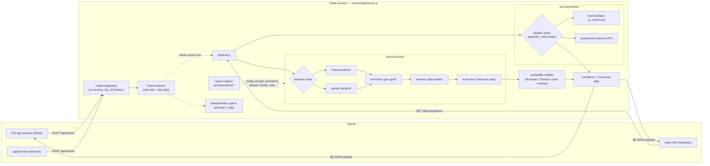
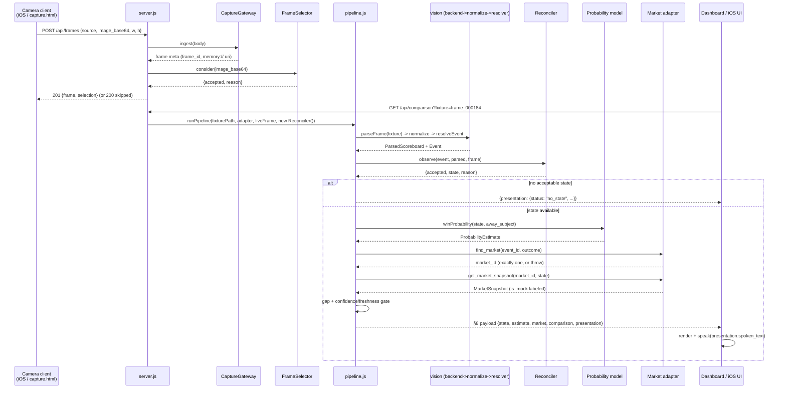
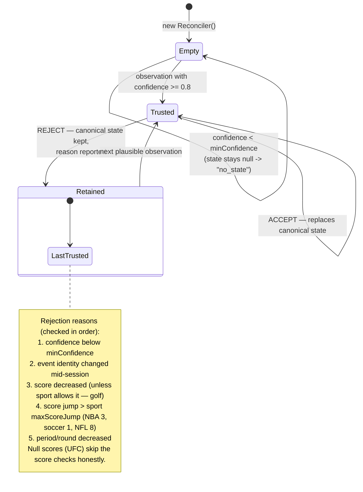

# BloomKnights Architecture

Snapshot of the system **as implemented** on 2026-07-11. The README describes intent; this document describes the code. Where the two differ, or where a parallel slice is clearly mid-landing, it says so. File paths are relative to the repo root.

The product loop: point a camera at a live sports broadcast, read the scoreboard, estimate the win probability, compare it with the prediction-market price, and speak/show a one-line result.

> **Current live path.** The production demo no longer fixture-parses camera frames. `/phone` or the native glasses companion sends continuous WebRTC media to `/capture`; only user-gated snapshots reach `LiveEventAnalyzer`, where Cerebras Gemma extracts a universal event observation from five frames. `services/demo/intelligence.js` exact-matches one of four historical event packs and an anchored checkpoint, then `/api/latest` serves the unified observation, prediction, mock market, evidence, and mock-research payload. The older `pipeline.js` fixture/normalizer/model path remains available through `/api/comparison` for deterministic lower-level tests and the data dashboard. Any fixture-first language below applies to that legacy/debug path, not `/api/frames` live analysis.

```text
camera frame -> gateway -> selector -> extraction -> normalize -> resolver
            -> reconciler -> probability model -> market adapter -> gate -> presentation
```

Everything runs as **one zero-dependency Node process** (`node services/api/server.js`, port 3000 or `$PORT`). The service directories are boundaries of ownership and contract, not separate deployables.

---

## 1. Component map

| Component | File(s) | Job |
|---|---|---|
| Capture gateway | `services/capture/gateway.js` | Source-agnostic frame ingestion (§7.1). Validates submissions, assigns `frame_id`, holds frames in a 30-slot in-memory ring buffer. `image_uri` is a `memory://` reference — nothing touches disk. |
| Frame selector | `services/capture/selector.js` | Rate limit (500 ms => ~2 fps ceiling) + near-duplicate skip (byte length + sampled FNV-1a hash of the base64 payload). Byte-level only; perceptual dedup is a documented future Slice 2 item. |
| Dataset writer | `services/capture/dataset.js` | Opt-in training-data collector. Writes **nothing** unless `DATASET_DIR` is set; when enabled, the server pairs accepted images with the latest trusted structured state. |
| Vision backends | `services/vision/backends/fixture.js`, `services/vision/backends/gemini.js` | Pluggable scoreboard extraction (§7.3). `fixture` reads the saved `parsed_scoreboard` from a fixture JSON (deterministic). `gemini` sends the frame image to Gemini (`gemini-2.0-flash`) with a `responseSchema` so it must return typed JSON; requires `GEMINI_API_KEY`, throws a clear "backend unavailable" error without it. |
| Normalize | `services/vision/normalize.js` (+ `normalize-soccer.js`, `-football.js`, `-ufc.js`, `-golf.js`) | Coerces noisy backend output ("2:14", "4th", "OT2", "45+2'", "-12 thru 16") into the typed `ParsedScoreboard` contract. Required fields throw on garbage; optional fields (possession, shot clock) drop silently. Backends that don't report confidences get `UNREPORTED_CONFIDENCE = 0.5` so the gate treats them as untrusted. |
| Resolver | `services/vision/resolver.js` | Broadcast label -> stable internal ID (`BOS` -> `nba_bos`) via exact-match alias tables. **No fuzzy matching, ever** — unknown labels throw. Builds `event_id` like `nba_2026_07_11_bos_nyk`. |
| Reconciler | `services/vision/reconciler.js` | Owns canonical game state (§7.5). Accept/reject per observation using per-sport rules; on rejection it **retains the last trusted state** instead of going null. See the state diagram below. |
| Sports registry | `services/sports/index.js` + `nba.js`, `soccer.js`, `football.js`, `ufc.js`, `golf.js` | One config object per sport bundling everything sport-specific: gemini prompt/schema, normalizer, alias table, probability model, reconciler rules, demo fixtures. `getSport(null)` -> NBA (the original slice, unchanged). Unknown ids throw. |
| Probability models | `services/probability/index.js` (NBA), `models/{football,soccer,ufc,golf}.js`, shared math in `models/gaussian.js` | Deterministic, bounded, explainable models. Consume `CanonicalGameState` only — never pixels. All clamp output to (0.001, 0.999): the model never claims certainty. |
| Market adapters | `services/market/index.js` (registry), `mock-adapter.js`, `polymarket-adapter.js` | Three operations behind one interface: `list_live_events` / `find_market` / `get_market_snapshot`. Registry picks by `MARKET_PROVIDER` env, **default `mock`**. Every mock snapshot is `is_mock: true`. |
| Pipeline | `services/api/pipeline.js` | Orchestrates one frame end-to-end and assembles the README §8 payload, including the confidence/freshness gate. |
| Server | `services/api/server.js` | `node:http` server: WebRTC signaling, analysis control, `POST /api/frames`, live-only `GET /api/latest`, rehearsal/catalog endpoints, legacy `GET /api/comparison`, and all demo pages. |
| Web apps | `apps/demo-web/index.html`, `capture.html`, `phone.html`, `data.html` | `/phone` is the browser camera provider; `/capture` receives continuous WebRTC video, runs local YOLO, gates Cerebras analysis, and renders live predictions/research. `/data` explores deterministic fixtures and saved stats. |
| iOS app | `apps/ios/BloomKnights/BloomKnights/` (SwiftUI) | `CameraStreamer.swift` samples the iPhone camera at ~1 fps, JPEG->base64, POSTs to `/api/frames` (source `"ios_app"`) — the phone stands in for the Meta glasses. `ApiClient.swift` + `Models.swift` mirror the backend JSON via `convertFromSnakeCase`. `Speaker.swift` reads `presentation.spoken_text` via AVSpeechSynthesizer. `DemoCatalog.swift` polls `GET /api/comparison` every 5 s. |
| Scripts | `scripts/evaluate-fixtures.js` (per-field extraction accuracy vs `packages/fixtures/expected/`), `scripts/evaluate-model.js` (scenario table + optional CSV calibration harness), `scripts/extract-clip-frames.sh` (ffmpeg ~1 fps frame extraction; output must stay out of git) | Measurement is real or absent — the gemini evaluation is *skipped*, not faked, without a key and real images; calibration numbers are never printed without historical data. |

Tests live in `tests/*.test.js` (`npm test` = `node --test`); `tests/market-adapter.test.js` replays real recorded Polymarket responses from `packages/fixtures/market/` so provider normalization is tested with zero network.

### System component diagram



---

## 2. The §7 contracts between components

Components exchange typed JSON, never free-form strings. The shapes live in README §7–§8 and are enforced by code, not a schema library (the recommended `packages/contracts/` directory does not exist yet — contracts are enforced by throwing normalizers/resolvers and by tests):

| Contract | Producer -> Consumer | Shape (see it in code) |
|---|---|---|
| **Frame** (§7.1) | gateway -> everything downstream | `{ frame_id, captured_at, source, image_uri, width, height }` — `gateway.js ingest()` |
| **ParsedScoreboard** (§7.3) | backend + normalize -> resolver, reconciler | `{ sport, league, away_team_text, home_team_text, away_score, home_score, period, clock_seconds, extras?, field_confidences }` — `normalize.js normalizeScoreboard()` |
| **Event** (§7.4) | resolver -> reconciler, market | `{ event_id, league, away_team_id, home_team_id }` — `resolver.js resolveEventForSport()` |
| **CanonicalGameState** (§7.5) | reconciler -> probability, dataset writer | `{ event_id, observed_at, accepted_at, *_team_id, *_score, period, clock_seconds, extras, confidence, source_frame_ids }` — `reconciler.js observe()` |
| **ProbabilityEstimate** (§7.6) | model -> pipeline | `{ event_id, outcome, probability, model_version, computed_at, input_state_observed_at, confidence }` — `sports/index.js estimateForSport()` |
| **MarketSnapshot** (§7.7) | adapter -> pipeline | `{ provider, market_id, event_id, outcome, yes_bid, yes_ask, display_probability, liquidity, provider_timestamp, received_at, is_mock }` — both adapters return it; Polymarket adds `display_probability_source` |
| **Comparison + full update** (§7.8/§8) | pipeline -> clients | assembled at the bottom of `pipeline.js runPipeline()` |

The adapter interface is three operations: `list_live_events(league, time_window)`, `find_market(event_id, outcome)`, `get_market_snapshot(market_id[, state])`. The mock's extra `state` argument lets historical-replay markets serve period-accurate prices; real adapters ignore it.

---

## 3. One frame end-to-end

What actually happens today (fixture-parse era — see the seam design in §4):

1. A client POSTs `{ source, captured_at, image_base64, width, height }` to `/api/frames`.
2. `CaptureGateway.ingest()` validates it, assigns `frame_000NNN`, pushes it into the ring buffer, returns §7.1 metadata.
3. `FrameSelector.consider()` applies the rate limit and duplicate check. Accepted frames update `lastSelected`; a live session is "active" for 10 s after the last accepted frame (`LIVE_SESSION_TTL_MS` in `server.js`).
4. The dashboard (or iOS app) polls `GET /api/comparison?fixture=frame_000184` every 5 s. The server allowlists the fixture name, builds a **fresh `Reconciler` per request** (demo moments are minutes of game time apart, so consecutive-frame invariants must not compare across them), and calls `runPipeline()`.
5. `extractState()` in `pipeline.js` parses the **fixture** (via `parseFrame` -> fixture backend -> `normalizeScoreboard`). If a live session is active, the live frame's metadata replaces the fixture's frame, but the parsed scoreboard is still the fixture's — the payload marks `extraction: "fixture_parse"` and `source: "live"` so nobody mistakes it for OCR.
6. The pipeline asserts `parsed.sport === sport.sportTag` (a soccer fixture served as NBA fails loudly), resolves the event, and runs `reconciler.observe()`. No acceptable state ever -> a `no_state` presentation ("I can see the game, but the scoreboard is not clear enough yet.").
7. `estimateForSport()` prices the **away-slot subject** (`state.away_team_id` — a Slice 1 convention: NBA away team, UFC red corner, golf leader; configurable outcome selection is future UX work).
8. `adapter.find_market(event_id, outcome)` requires exactly one match (throws otherwise), then `get_market_snapshot()` returns the priced snapshot. Displayed market probability = bid/ask midpoint (Polymarket falls back to last trade and labels it).
9. Gap = `(model_probability − market_probability) × 100`, rounded to 0.1 pt. The gate then sets `presentation.status`: `low_confidence` if `state.confidence < 0.8`, `stale_market` if the snapshot is older than 30 s, else `ready` with `short_text`/`spoken_text`.
10. The dashboard renders the numbers, the HUD lens preview, and optionally speaks `spoken_text` via the Web Speech API; the iOS app does the same via AVSpeechSynthesizer.

### Sequence diagram: frame -> spoken result



### Reconciler accept/reject state diagram

Rules come from the sport config (`reconcilerRules`); defaults are the NBA rules. Confidence = min over the sport's `confidenceFields` in `field_confidences`.



Note: README §7.5 suggests optionally requiring the same value in two consecutive frames before accepting a low-confidence update. The implemented reconciler is single-observation (threshold + invariants); no two-frame confirmation exists.

---

## 4. Seam design

Two seams keep the demo honest and swappable. Both follow the same pattern: the deterministic/offline implementation is the default, the real one is a sibling behind the identical interface, and the payload always labels which one ran.

**Extraction seam (fixture vs gemini).** `extractScoreboard(frame, backend, sport)` in `services/vision/index.js` accepts a backend by name (`"fixture"`, `"gemini"`) or as a `{ name, extract }` object. Both feed the same normalizer, so downstream never knows which ran. The pipeline-level seam is `extractState()` in `pipeline.js`: today it always fixture-parses (even for live frames) and stamps `extraction: "fixture_parse"`; Slice 2's real OCR replaces the body of that one function and nothing else. The gemini backend is already built and evaluated by `scripts/evaluate-fixtures.js`, but only when `GEMINI_API_KEY` is set and a real image exists on disk — accuracy is measured, never invented.

**Market seam (mock vs polymarket).** `services/market/index.js` resolves the adapter once at startup from `MARKET_PROVIDER` (default `mock`). The mock carries hand-written markets for all five demo sports, including per-period `price_schedule` entries so historical replays show period-accurate prices instead of one dishonest static number; everything it returns is `is_mock: true` and the UI shows a "Simulated market feed" banner. The Polymarket adapter (`createPolymarketAdapter`, injectable `fetchImpl` for fixture replay) maps internal IDs deterministically to Gamma slugs (`nba_2026_03_29_nyk_okc` <-> `nba-nyk-okc-2026-03-29`), demands a unique event/moneyline/outcome at every step, and treats "no matching market" as a first-class `NoMatchingMarketError` with a user-presentable `safeMessage` (expected in the off-season), never a TypeError.

---

## 5. Multi-sport registry design

`services/sports/index.js` maps sport ids to config modules. A sport config is pure data + function references — adding a sport touches no pipeline code:

- `id`, `label`, `league`, `sportTag` (the `ParsedScoreboard.sport` value it expects — the pipeline cross-checks this), `eventDate` (demo game date embedded in event ids)
- `vision.prompt` + `vision.responseSchema` for the gemini backend
- `normalize` — the sport's normalizer (soccer counts up with stoppage time and puts the minute on `extras.minute`; golf has no clock at all and carries `extras.holes_remaining`)
- `aliases` — the resolver table
- `model` (`{ winProbability, MODEL_VERSION }`) + `modelOptions` (e.g. UFC's `pregameProbability: 0.62` for Khabib, NFL's `0.61` for NE)
- `reconcilerRules` — per-sport invariants (soccer `maxScoreJump: 1`; golf `allowScoreDecrease: true` because to-par scores drop with birdies; UFC has no score at all)
- `fixtures`, `defaultFixture`, `demo_moments` — the famous replay moments

The five sports and their models:

| Sport | Model | Approach |
|---|---|---|
| NBA (default) | `nba-win-probability-v1` | Brownian/Stern margin diffusion, sd 11.5 pts full game, home edge 2.5 pts |
| NFL | `nfl-win-probability-v1` | Same Brownian approach, NFL constants (sd 13.5, home edge 2.0, 10-min OT) |
| Soccer | `soccer-win-probability-v1` | Independent Poisson goals scaled by minutes left; a draw is not a win, so the two teams' probabilities don't complement — and a shootout win is *not* counted, which is the demo's honest talking point vs the match market |
| UFC | `ufc-win-probability-v1` | Prior-anchored (no on-screen score exists): `0.5 + (prior − 0.5) × (0.6 + 0.4 × fraction remaining)` — with no prior it stays at 0.5, never inventing confidence |
| Golf | `golf-win-probability-v1` | Two-player stroke-lead race: `phi(lead / (0.45 × sqrt(holes remaining)))`; the rest of the field is knowingly ignored |

All gaussian models share `phi`/`probit`/`clampProbability` from `models/gaussian.js`.

**In-flight status:** the registry, `runPipeline(..., sportId)`, fixtures for soccer/NFL/UFC, and the web/iOS sport pickers all exist — but `server.js` does not yet accept a `sport` query param, expose `GET /api/sports`, or allowlist the non-NBA fixtures. Golf is furthest behind: `masters19_h12.json` exists in `packages/fixtures/frames/` but `masters19_h16.json` does not, and neither golf moment has an expected-state file. Clients handle this gracefully (fallback catalogs, "not loaded yet" messaging).

---

## 6. Privacy model

README §16 baseline, as implemented:

- **Frames live in memory only.** The gateway's ring buffer holds at most 30 frames; `image_uri` is `memory://capture/<frame_id>`. Nothing writes camera bytes to disk in the default configuration.
- **Dataset collection is strictly opt-in.** `DatasetWriter` (`services/capture/dataset.js`) is inert unless `DATASET_DIR` is set. When enabled it saves accepted frames as labeled training pairs under `DATASET_DIR/<sport>/`, using the latest reconciled state as the label — and saves the image *unlabeled* when no state exists, because a label is never invented. (Not yet wired into the server.)
- **No secrets in the repo.** `GEMINI_API_KEY` comes from the environment; the gemini backend throws without it. Polymarket's Gamma API needs no auth.
- **Committed fixtures are sanitized or public.** Frame fixtures are hand-written JSON (parsed state, no image bytes); market fixtures are real, unmodified public Gamma API responses documented in `packages/fixtures/market/README.md`. `scripts/extract-clip-frames.sh` warns that its output is raw footage and must stay out of git.

## 7. Honest-fallback philosophy

The demo resilience ladder (README §13) is engineered into the payloads, not just rehearsed:

- Every mock market value is `is_mock: true`; the dashboard shows a persistent "Simulated market feed — mock data, not live prices" banner, and historical replays are tagged "Replay · historical match."
- `extraction: "fixture_parse"` and `source: "live" | "fixture"` in every comparison payload say exactly how much of the path was real.
- The gate degrades to safe sentences instead of wrong numbers: `no_state`, `low_confidence` (< 0.8), `stale_market` (> 30 s) each suppress the comparison.
- Models clamp to (0.001, 0.999) — never certainty; the UFC model returns exactly 0.5 with no prior; the soccer model documents that it excludes shootouts rather than fudging the number.
- Missing capability is reported, not simulated: no `GEMINI_API_KEY` -> evaluation "skipped"; no calibration data -> no calibration numbers (`models/metadata/nba-win-probability-v1.json` records `status: "not_calibrated"` explicitly); off-season -> `NoMatchingMarketError` with a presentable message.
- Unresolvable inputs fail loudly at the earliest point: unknown team text, unknown sport id, unknown market provider, ambiguous market matches, and sport/fixture mismatches all throw with the offending value in the message.

## 8. Where the code differs from the README

- README §10 says "the codebase has not yet committed to a language or framework" — it has: zero-dependency Node ESM (plus a SwiftUI iOS client). §10's `packages/contracts/`, `apps/companion/`, and `tests/integration|end-to-end/` directories don't exist; contracts are enforced in code and tests live flat in `tests/`.
- README §7.5's optional two-consecutive-frame confirmation is not implemented (single-observation threshold + invariants instead).
- README §9's latency budget is aspirational; no per-stage instrumentation exists yet.
- The frame selector's "prefer sharp, unobstructed frames / ignore non-broadcast frames" (§7.2) is not implemented — only rate limiting and byte-level dedup.
- Clients are ahead of the server: `/api/sports`, `/api/stats`, `/api/dataset/summary`, and the `sport` param on `/api/comparison` are consumed by `index.html` / `data.html` / `capture.html` / the iOS app but not served yet (parallel slices in flight; see `docs/architecture/API.md`).
